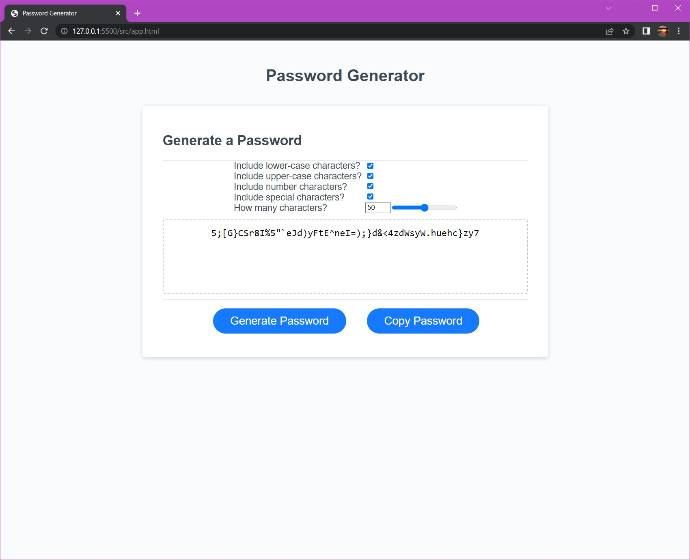

# Random Password Generator - (HTML, CSS, JavaScript)

### Description:

* Random password generator made with HTML, CSS, and JavaScript. <a id="raw-url" href="https://fremen432.github.io/Password-Generator-JS/">Click to view Live Page</a>.
* Windows desktop application built with Electron toolkit. <a id="raw-url" href="https://github.com/fremen432/Password-Generator-JS/releases/download/Password-Generator/Password-Generator-win32-x64.zip">Click to download</a>.

    

